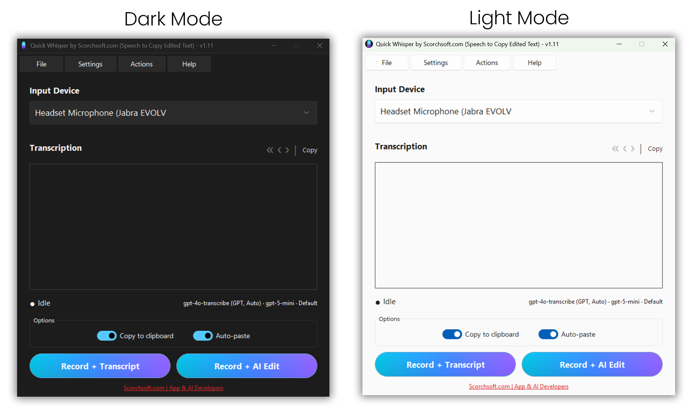

# Scorchsoft QuickWhisper

You can find more information about Quick Whisper here:
[Scorchsoft Quick Whisper - Free Speech-to-Copy-Edited-Text AI App for Desktop](https://www.scorchsoft.com/blog/speech-to-copyedited-text-app/)

QuickWhisper is a user-friendly, voice-to-text transcription app that leverages OpenAI's Whisper model for accurate audio transcription. With QuickWhisper, users can start recording their voice, automatically transcribe it to text, copy it to the clipboard, and optionally paste it into other applications. Additionally, the transcription text can be processed through OpenAI ChatGPT for a polished, copy-edited output.

## Cross-Platform Support

While QuickWhisper was originally developed for Windows, **the codebase has been updated to support Linux and macOS** as well. Windows and Linux binaries are currently available via the [GitHub release log](https://github.com/andrew-scorchsoft/scorchsoft-quick-whisper/releases)

## Features

- **Simple Recording & Transcription**: Quickly record audio and transcribe it to text with a single click or a hotkey (`Ctrl+Alt+J` for edit, `Ctrl+Alt+Shift+J` for transcription).
- **Toggle or Push-to-Talk**: Press once to start and again to stop, or hold the shortcut and release to send - whichever suits the length of what you are dictating.
- **Auto Copy & Paste**: Automatically copy transcriptions to the clipboard and paste them into other applications if desired. When auto-copy is off, whatever you had copied before is put back once the paste is done.
- **Optional OpenAI ChatGPT Editing**: Enhance your transcriptions using OpenAI ChatGPT for a polished, copy-edited text output.
- **One-click Prompt and Model Switching**: The line under the transcript names the transcription model, the copy-editing model and the selected prompt - click any of them to change it.
- **Searchable History**: Everything you dictate is kept with the time, the prompt used and how long you spoke, and can be searched from **File > Browse History**.
- **Recording Feedback**: A live input level meter and timer while recording, plus a red tray icon so you can tell you are recording even when the window is hidden.
- **Customizable Settings**: Enable or disable auto-copy and auto-paste, choose from available input devices, and toggle OpenAI ChatGPT editing.

## Screenshot



## Installation

1. Clone the repository or download the code to your local machine.

2. Ensure you have Python 3.x installed.

3. Set up a virtual environment and install dependencies:

   **Windows:**
   ```bash
   python -m venv venv
   venv\Scripts\activate
   pip install -r requirements.txt
   ```

   **Mac:**
   ```bash
   python -m venv venv
   source venv/bin/activate
   pip install -r requirements.txt
   ```

   **Linux:**
   ```bash
   python3 -m venv venv --system-site-packages
   source venv/bin/activate
   pip install -r requirements.txt
   ```

4. The app will prompt you for your OpenAI API key on first run. Alternatively, you can pre-configure it in `config/credentials.json`:

   ```json
   {
     "openai_api_key": "your_openai_api_key_here"
   }
   ```

### Linux-Specific Setup

1. Install required system packages (before creating the virtual environment):
   ```bash
   sudo apt install portaudio19-dev python3-tk python3-gi gir1.2-gstreamer-1.0 gir1.2-gtk-3.0 gir1.2-ayatanaappindicator3-0.1 gstreamer1.0-plugins-base espeak
   ```

### Mac-Specific Setup

1. Install portaudio first:
   ```bash
   brew install portaudio
   ```

2. You may need to grant accessibility permissions to the app for keyboard shortcuts:
   - Go to System Preferences > Security & Privacy > Privacy > Accessibility
   - Add QuickWhisper to the list of allowed apps

## Usage

1. Run the application:
   ```bash
   python quick_whisper.py
   ```

2. Select an input device, then press one of the recording buttons or use the hotkeys:

   **Windows/Linux:**
   - `Ctrl+Alt+J` for Record + AI Edit
   - `Ctrl+Alt+Shift+J` for Record + Transcribe
   - `Ctrl+Alt+X` to Cancel Recording
   - `Ctrl+Alt+R` to Retry the Last Recording
   - `Alt+Left` / `Alt+Right` to cycle through prompts

   **Mac:**
   - `⌘+Alt+J` for Record + AI Edit
   - `⌘+Alt+Shift+J` for Record + Transcribe
   - `⌘+X` to Cancel Recording
   - `⌘+Alt+R` to Retry the Last Recording
   - `⌘+[` / `⌘+]` to cycle through prompts

   `Escape` also cancels a recording while the Quick Whisper window has focus.

3. After recording, the app will transcribe the audio and display the text in the transcription area. The text can be automatically copied to the clipboard or pasted into other applications, depending on the settings.

4. Enable "Auto Copy-edit with OpenAI ChatGPT" for advanced text processing, allowing OpenAI ChatGPT to edit the transcription for improved readability and structure.

## Configuration

QuickWhisper includes a configuration system that allows you to customize recording behavior. Access it via **Settings > Config**.

### Recording Location

Choose where audio recording files are saved:

- **Alongside application (recommended)**: Saves recordings in a `tmp` folder next to the application
- **In AppData folder**: Uses the OS-appropriate application data directory:
  - Windows: `%APPDATA%\QuickWhisper\recordings`
  - macOS: `~/Library/Application Support/QuickWhisper/recordings`
  - Linux: `~/.config/QuickWhisper/recordings`
- **Custom folder**: Specify any folder of your choice

### File Handling

Control how recording files are managed:

- **Overwrite the same file each time (default)**: Saves disk space by reusing the same filename
- **Save each recording with date/time in filename**: Creates unique files like `recording_20240101_143052.wav`
  - ⚠️ **Warning**: This option can consume significant disk space over time

### Recording Settings

**Settings > Configuration > Recording** covers how recording behaves:

- **Recording shortcut behaviour**: toggle (press to start, press again to stop) or
  push to talk (hold the shortcut, release to send). The buttons in the main
  window always toggle, whichever mode you choose.
- **Recording limits**: the maximum length before recording stops automatically
  to stay within the upload size limit, the minimum length below which an
  accidental tap of the shortcut is discarded rather than costing an API call,
  and whether recordings with no detected speech are skipped.
- **While recording**: whether to show the live input level meter, and whether
  the short feedback sounds are played.

Related settings live in the categories they belong to: **History & Storage**
holds where recordings are saved, how long they are kept and how much
dictation history is remembered; **Output & Clipboard** holds auto-copy,
auto-paste, whether the previous clipboard contents are restored afterwards,
and the paste method to use if auto-paste misbehaves.

### Config Files

All configuration settings are saved to JSON files in the `config/` folder:
- `settings.json`: User preferences, model settings, shortcuts, recording options
- `credentials.json`: API key (to be encrypted in a future release)
- `prompts.json`: Custom AI prompts

Settings will persist between application restarts. If you're upgrading from an older version that used `.env` files, your settings will be automatically migrated to the new JSON format.

## Language Support (i18n)

QuickWhisper supports multiple languages for the user interface:

- **English** (default)
- **French** (Français)
- **German** (Deutsch)
- **Spanish** (Español)
- **Chinese Simplified** (简体中文)
- **Arabic** (العربية)
- **Japanese** (日本語)
- **Korean** (한국어)
- **Portuguese** (Português)
- **Russian** (Русский)

### Changing the Language

1. Go to **Settings > Configuration**
2. Select the **Language** category
3. Choose between:
   - **Auto-detect from system**: Uses your operating system's language setting
   - **Manual selection**: Choose a specific language from the dropdown

The interface will update immediately when you save the settings - no restart required.

### Linux Users: Chinese Font Support

If Chinese characters appear as boxes (□□), install CJK fonts:
```bash
sudo apt install fonts-noto-cjk
```

### For Developers: Adding New Translations

If you want to contribute translations or add a new language:

1. **Extract translatable strings** to update the template:
   ```bash
   python3 tools/i18n_tools.py extract
   ```

2. **Create a new language** (e.g., Italian):
   ```bash
   python3 tools/i18n_tools.py init it
   ```

3. **Edit the .po file** at `locale/it/LC_MESSAGES/quickwhisper.po` with your translations

4. **Compile translations** to .mo files:
   ```bash
   python3 tools/compile_mo.py
   ```

5. **Add the language** to `SUPPORTED_LANGUAGES` in `utils/i18n.py`

## Building an Executable

To create a standalone executable, first ensure you have your virtual environment activated with dependencies installed, then install PyInstaller:

```bash
pip install --no-cache-dir pyinstaller
```

**Build (recommended for all platforms):**

```bash
python tools/build.py              # windowed release build
python tools/build.py --console    # console-enabled diagnostic build
```

Output is written to `dist/` using the same version as the app (from `utils/app_version.py`):

```
dist/quick_whisper-2.4.1-windows-x86_64.exe
dist/quick_whisper-2.4.1-windows-x86_64-console_enabled.exe
```

The spec file detects your platform, includes the right hidden imports, and names the file `quick_whisper-{version}-{os}-{arch}` (plus `-console_enabled` for the diagnostic build).

**Linux prerequisites:**
- Install espeak for TTS: `sudo apt install espeak`
- Install tkinter: `sudo apt install python3-tk`
- For best hotkey support, run under X11 (Wayland has limited global hotkey support)

## License

This project is licensed under the terms specified in the LICENSE.md file.

## Memory Diagnostics

QuickWhisper logs resource usage to the console every 60 seconds. To use this, run the app from a terminal rather than double-clicking the executable:

```bash
python quick_whisper.py
```

### Reading the Logs

Every 60 seconds you will see output like:

```
============================================================
[MEMORY DIAG] uptime=5.0min  RSS=142.3MB  delta=+2.1MB  threads=8
[MEMORY DIAG] gc_objects=45231  gc_counts=(47, 3, 1)
[MEMORY DIAG] audio: sounds=6  streams_opened=2  streams_closed=2  frames_peak=4800  recordings=2/2
[MEMORY DIAG] threads: ['MainThread', 'sound_0', 'sound_1', 'pynput-listener', ...]
============================================================
```

### What Each Field Means

| Field | Meaning |
|-------|---------|
| `RSS` | Total physical memory used by the process (in MB) |
| `delta` | Change in RSS since the last log entry. Consistently positive = likely leak |
| `threads` | Number of active threads. Should stay roughly constant |
| `gc_objects` | Total Python objects tracked by the garbage collector. Steady growth = object leak |
| `gc_counts` | Pending GC work per generation `(gen0, gen1, gen2)` |
| `sounds` | Total sound effects played since startup |
| `streams_opened` / `streams_closed` | PyAudio recording streams. These two numbers should always match |
| `frames_peak` | Largest audio buffer recorded (in frames). High values expected for long recordings |
| `recordings` | `started/stopped` count. Should always match |

### Signs of a Memory Leak

- **RSS delta is consistently positive** (e.g. `+2MB`, `+3MB`, `+5MB` every minute) even when idle — something is leaking.
- **Thread count keeps climbing** — threads are being created but not finishing. Look at the thread names list to see which ones are accumulating.
- **`streams_opened` > `streams_closed`** — a PyAudio stream was not properly closed after recording.
- **`recordings` started > stopped** — a recording was started but never completed or cancelled.
- **`gc_objects` steadily increasing** — Python objects are being created and never freed (circular references or growing collections).

### Warning Messages

You may also see these in the console output:

- `[MEMORY] WARNING: pynput listener thread did not terminate within 5s` — The keyboard hook listener did not shut down cleanly during a hotkey re-registration. If this appears repeatedly, it indicates pynput threads are leaking.

If the memory leak reoccurs, copy the full console output and include it in a bug report.

## About Scorchsoft

We can deliver your innovative, technically complex project, using the latest web and mobile application development technologies. Scorchsoft develops online portals, applications, web and mobile apps, and AI projects. With over fourteen years experience working with hundreds of small, medium, and large enterprises, in a diverse range of sectors, we'd love to discover how we can apply our expertise to your project.

[Scorchsoft App Developers](https://www.scorchsoft.com/blog/speech-to-copyedited-text-app/)
