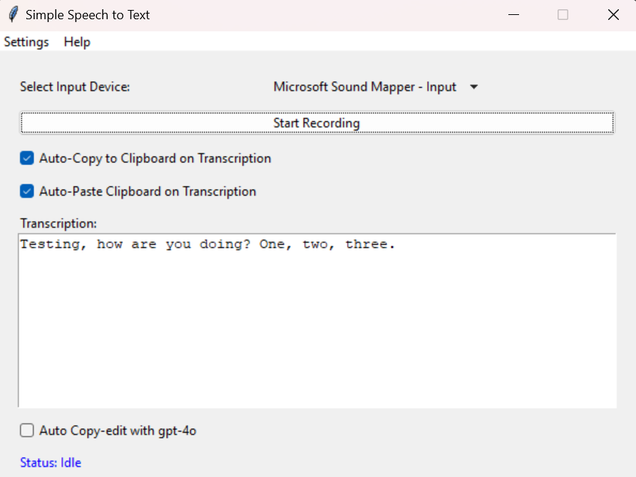

Here’s a sample README file for your project, including sections for installation, usage, features, and a placeholder for the screenshot:

---

# QuickWhisper

QuickWhisper is a user-friendly, voice-to-text transcription app that leverages OpenAI's Whisper model for accurate audio transcription. With QuickWhisper, users can start recording their voice, automatically transcribe it to text, copy it to the clipboard, and optionally paste it into other applications. Additionally, the transcription text can be processed through GPT-4 for a polished, copy-edited output.

## Features

- **Simple Recording & Transcription**: Quickly record audio and transcribe it to text with a single click or a hotkey (`Win+J`).
- **Auto Copy & Paste**: Automatically copy transcriptions to the clipboard and paste them into other applications if desired.
- **Optional GPT-4 Editing**: Enhance your transcriptions using GPT-4 for a polished, copy-edited text output.
- **Customizable Settings**: Enable or disable auto-copy and auto-paste, choose from available input devices, and toggle GPT-4 editing.

## Installation

1. Clone the repository or download the code to your local machine.

2. Ensure you have Python 3.x installed. Install the required dependencies with the following command:

    pip install tkinter pyaudio openai python-dotenv pydub keyboard playsound pyperclip audioplayer wave pystray pygame

3. Place your OpenAI API key in a `.env` file located in the `config` folder or enter it directly in the app.

    **Example** `.env` file in `config/.env`:
    ```plaintext
    OPENAI_API_KEY=your_openai_api_key_here
    ```

    This is optional, if you don't define your key then the app will ask for it on first run

## Usage

1. Run the application:

    ```bash
    python quick_whisper.py
    ```

2. Select an input device, then press `Start Recording` or use the `Win+J` hotkey to begin recording.

3. After recording, the app will transcribe the audio and display the text in the transcription area. The text can be automatically copied to the clipboard or pasted into other applications, depending on the settings.

4. Enable “Auto Copy-edit with GPT-4” for advanced text processing, allowing GPT-4 to edit the transcription for improved readability and structure.

## Screenshot



_(Replace `screenshot_placeholder.png` with an actual screenshot of the application interface)_

## License

This project is licensed under the terms specified in the LICENSE.md file.

## Making an installer

Windows:
`python -m PyInstaller --onefile --windowed --add-data "assets;assets" quick_whisper.py`

Mac:
`pyinstaller --onefile --add-data "assets:assets" quick_whisper.py`


